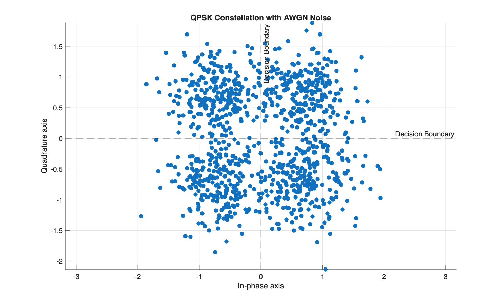
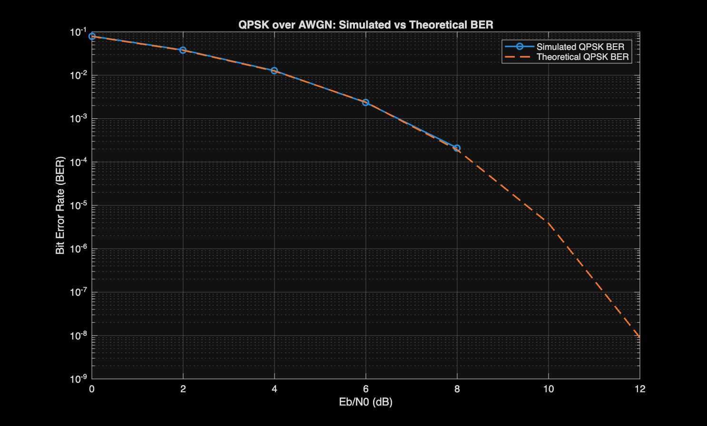
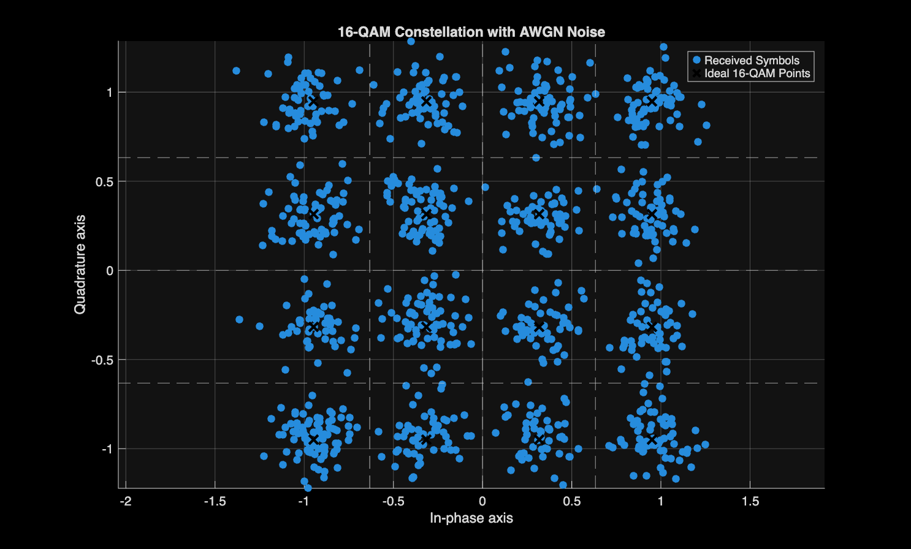
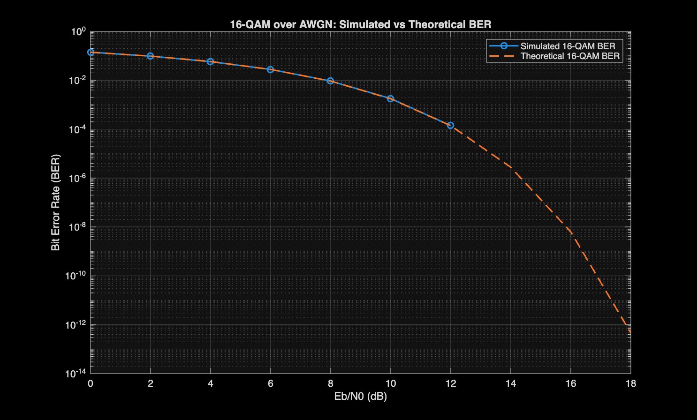
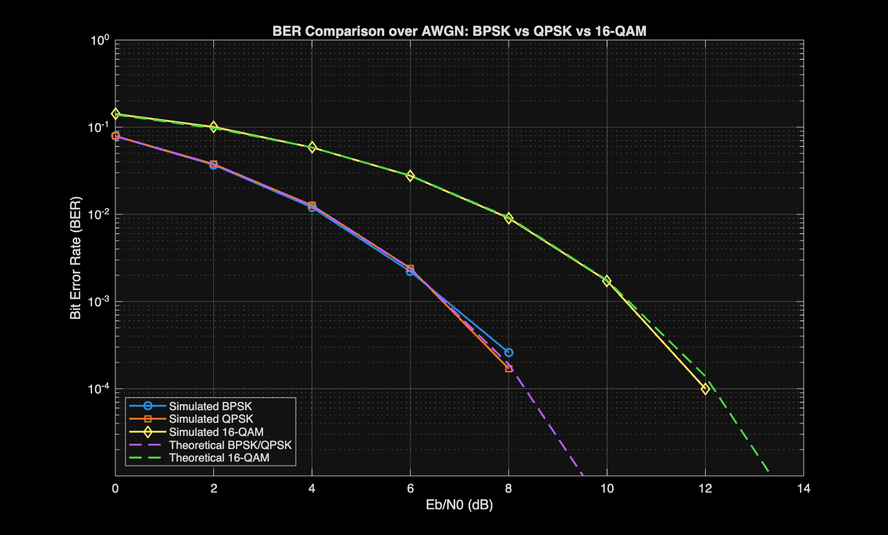

# Digital Communications Link Simulator in MATLAB

This project simulates a digital communication link in MATLAB, comparing BPSK, QPSK, and 16-QAM modulation over an AWGN channel using constellation diagrams, Monte Carlo BER simulation, and theoretical BER curves.

## Current Features

- BPSK modulation and demodulation
- QPSK modulation and demodulation
- 16-QAM modulation and demodulation
- AWGN channel model
- Bit Error Rate (BER) calculation
- BER vs Eb/N0 simulation
- Noisy constellation visualization for BPSK, QPSK, and 16-QAM
- Theoretical BER comparison
- BPSK vs QPSK vs 16-QAM AWGN performance comparison
  
## Current Results

The simulations show that BER decreases as Eb/N0 increases. BPSK and QPSK show very similar BER performance over AWGN, while 16-QAM requires higher Eb/N0 to achieve the same BER because its constellation points are closer together.

Example BER results:

| Eb/N0 (dB) | BPSK BER | QPSK BER | 16-QAM BER |
|---|---:|---:|---:|
| 0 | 0.078980 | 0.079130 | 0.141570 |
| 2 | 0.036990 | 0.037710 | 0.097260 |
| 4 | 0.012020 | 0.012680 | 0.057670 |
| 6 | 0.002210 | 0.002410 | 0.027860 |
| 8 | 0.000260 | 0.000170 | 0.009310 |
| 10 | 0.000000 | 0.000000 | 0.001790 |
| 12 | 0.000000 | 0.000000 | 0.000140 |

## BER Curves and Constellations

### BPSK Simulated BER Curve


### BPSK Simulated vs Theoretical BER


### QPSK Constellation



### QPSK Simulated vs Theoretical BER



### 16-QAM Constellation



### 16-QAM Simulated vs Theoretical BER



### BPSK vs QPSK vs 16-QAM AWGN Comparison



## How to Run

Open MATLAB and set the current folder to this project folder.

Run:

```matlab
a01_bpsk_awgn_single_snr
```

to simulate BPSK over AWGN at one Eb/N0 value and view the noisy BPSK constellation.

Run:

```matlab
a02_bpsk_awgn_ber_curve
```

to generate the simulated BPSK BER vs Eb/N0 curve.

Run:

```matlab
a03_bpsk_awgn_theory_comparison
```

to compare the simulated BPSK BER curve with the theoretical BPSK BER curve.

Run:

```matlab
a04_qpsk_awgn_single_snr
```

to simulate QPSK over AWGN at one Eb/N0 value and view the noisy QPSK constellation.

Run:

```matlab
a05_qpsk_awgn_ber_curve
```

to generate the simulated QPSK BER curve and compare it with the theoretical QPSK BER curve.

Run:

```matlab
a06_bpsk_qpsk_awgn_comparison
```

to compare BPSK and QPSK BER performance over an AWGN channel.

Run:

```matlab
a07_16qam_awgn_single_snr
```

to simulate 16-QAM over AWGN at one Eb/N0 value and view the noisy 16-QAM constellation.

Run:

```matlab
a08_16qam_awgn_ber_curve
```

to generate the simulated 16-QAM BER curve and compare it with the theoretical 16-QAM BER curve.

Run:

```matlab
a09_awgn_all_modulations_comparison
```

to compare BPSK, QPSK, and 16-QAM BER performance on the same AWGN plot.
