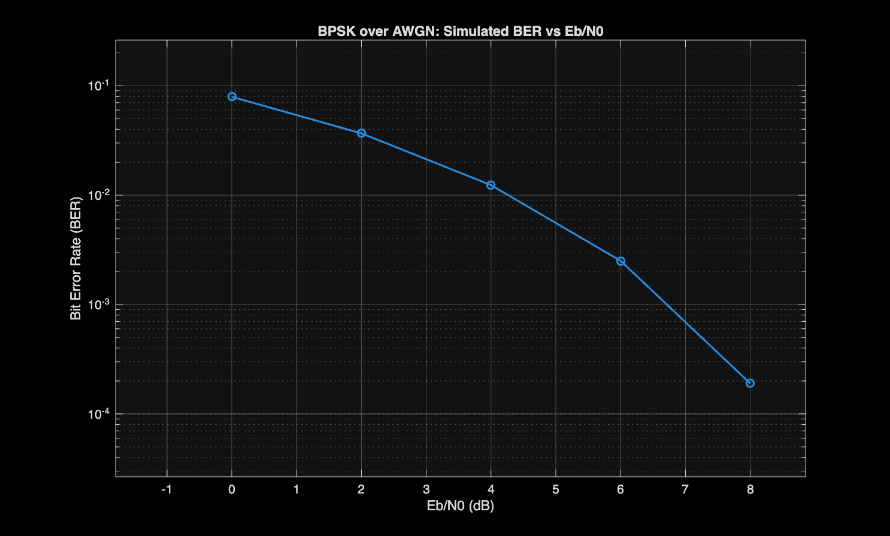
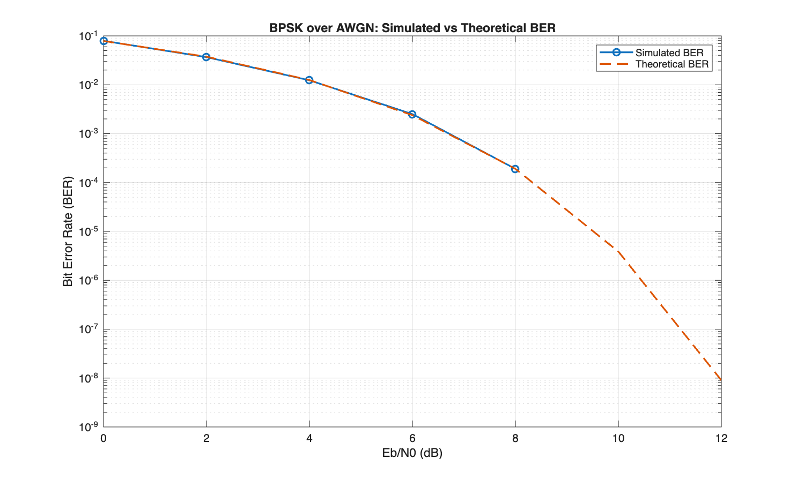

# Digital Communications Link Simulator in MATLAB

This project simulates a basic digital communication system using MATLAB.

## Current Features

- BPSK modulation and demodulation
- AWGN channel model
- Bit Error Rate (BER) calculation
- BER vs Eb/N0 simulation
- Noisy BPSK constellation visualization
- Theoretical BPSK BER comparison

## Current Results

The simulation shows that the Bit Error Rate decreases as Eb/N0 increases.

Example result from the BPSK over AWGN simulation:

| Eb/N0 (dB) | BER |
|---|---|
| 0 | 0.079300 |
| 2 | 0.036730 |
| 4 | 0.012360 |
| 6 | 0.002510 |
| 8 | 0.000190 |
| 10 | 0.000000 |
| 12 | 0.000000 |

## BER Curves

### Simulated BER Curve



### Simulated vs Theoretical BER



## How to Run

Open MATLAB and set the current folder to this project folder.

Run:

```matlab
a01_bpsk_awgn_single_snr
```

to simulate BPSK over AWGN at one Eb/N0 value and view the noisy constellation.

Run:

```matlab
a02_bpsk_awgn_ber_curve
```

to generate the simulated BER vs Eb/N0 curve.

Run:

```matlab
a03_bpsk_awgn_theory_comparison
```

to compare the simulated BER curve with the theoretical BPSK BER curve.
