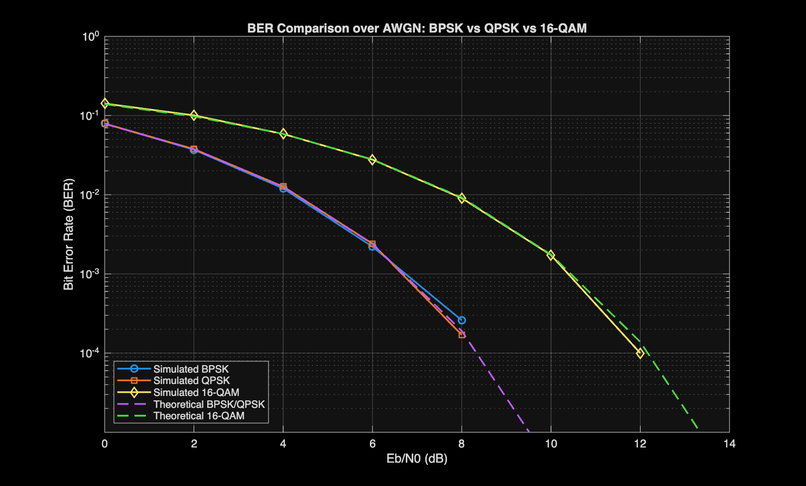
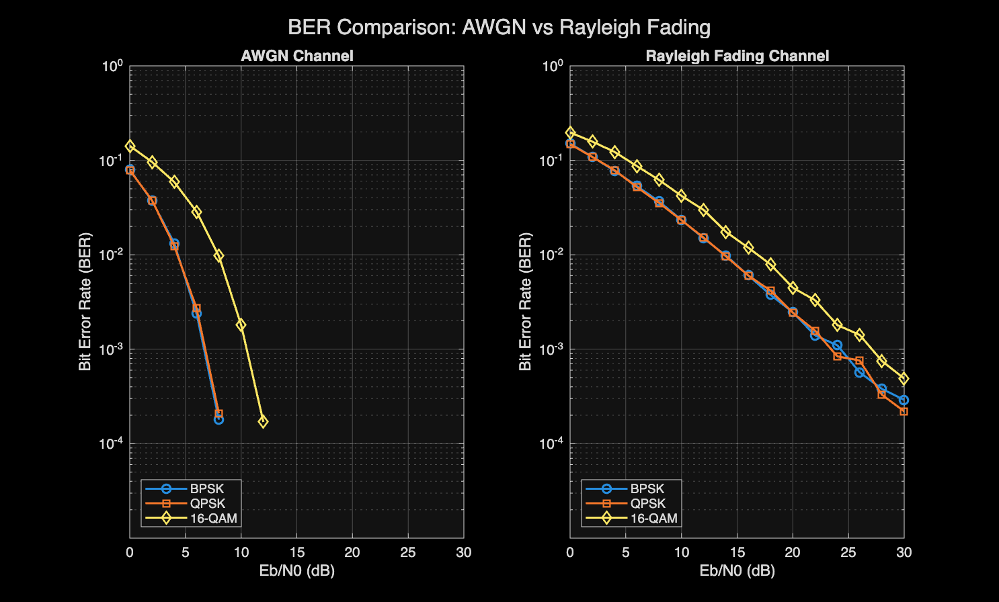
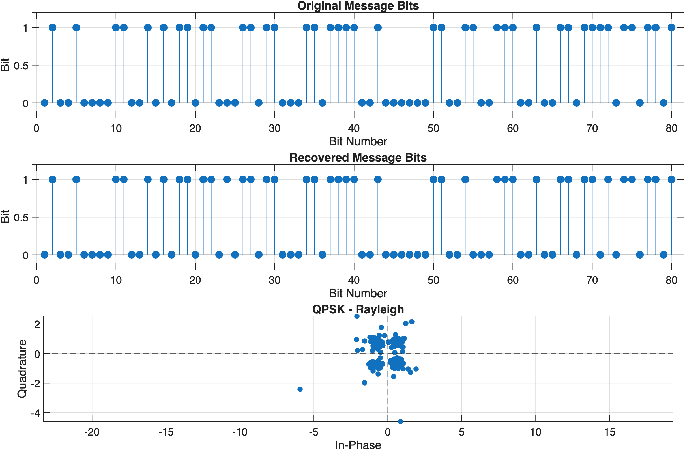

# Digital Communications Link Simulator in MATLAB

A modular MATLAB digital communications simulator for transmitting binary and text data using **BPSK, QPSK, and 16-QAM** over **AWGN and Rayleigh fading channels**.

The project includes BER analysis, constellation visualization, theoretical performance comparisons, custom text transmission, Rayleigh channel equalization, and a reusable communication-link engine.

## Overview

The simulator models a complete digital communication chain:

```text
Input Message
     ↓
Text-to-Bits Conversion
     ↓
Digital Modulation
BPSK / QPSK / 16-QAM
     ↓
Channel
AWGN / Rayleigh Fading
     ↓
Channel Equalization
(Rayleigh)
     ↓
Demodulation
     ↓
Bit Error Rate Calculation
     ↓
Recovered Message
```

The project began as individual communication-system experiments and was progressively refactored into a modular simulator with reusable MATLAB functions.

## Features

- BPSK, QPSK, and 16-QAM modulation and demodulation
- AWGN channel simulation
- Rayleigh fading channel simulation
- Perfect-channel-knowledge equalization for Rayleigh fading
- Bit Error Rate (BER) calculation
- BER vs Eb/N0 Monte Carlo simulations
- Theoretical and simulated BER comparison
- Constellation visualization
- Custom text-to-binary transmission
- Recovered-message reconstruction
- Selectable modulation and channel models
- Modular reusable communication functions
- Main simulator interface using a reusable communication-link engine

## Supported Configurations

| Modulation | Bits per Symbol | AWGN | Rayleigh |
|---|---:|:---:|:---:|
| BPSK | 1 | ✓ | ✓ |
| QPSK | 2 | ✓ | ✓ |
| 16-QAM | 4 | ✓ | ✓ |

Higher-order modulation increases the number of bits transmitted per symbol, but generally requires a better channel quality to maintain the same BER.

## Quick Start

Open MATLAB and set the current folder to the project directory.

Run:

```matlab
main_simulator
```

The main user settings are located near the top of `main_simulator.m`:

```matlab
message = "Hello from my digital communication simulator!";

config.modulation = "QPSK";
config.channel = "Rayleigh";
config.EbN0_dB = 10;
```

Available modulation settings:

```matlab
"BPSK"
"QPSK"
"16QAM"
```

Available channel settings:

```matlab
"AWGN"
"Rayleigh"
```

You can replace the message with your own text and change the communication configuration before running the simulator.

## Example Output

A simulation reports the original and recovered message together with communication-system statistics such as:

```text
Modulation: QPSK
Channel: Rayleigh
Eb/N0: 10 dB
Bits per symbol: 2
Number of transmitted bits: 368
Number of transmitted symbols: 184
Number of bit errors: 10
BER: 0.027174
```

Because channel noise and Rayleigh fading are randomly generated, the exact BER and recovered message vary between runs.

## Project Architecture

```text
Digital-Comms-Link-Simulator/
│
├── main_simulator.m
│
├── src/
│   ├── textToBits.m
│   ├── bitsToText.m
│   ├── modulateSignal.m
│   ├── demodulateSignal.m
│   ├── applyChannel.m
│   ├── calculateBER.m
│   └── runCommunicationLink.m
│
├── figures/
│
├── a01_...m
├── ...
└── a16_...m
```

### Core Engine

`runCommunicationLink.m` runs the complete digital communication chain and returns a MATLAB structure containing the transmission results.

Example:

```matlab
config.modulation = "QPSK";
config.channel = "Rayleigh";
config.EbN0_dB = 10;

result = runCommunicationLink( ...
    "Testing my communication engine!", ...
    config ...
);
```

The returned structure includes values such as:

```matlab
result.originalMessage
result.recoveredMessage
result.BER
result.numErrors
result.transmittedBits
result.receivedBits
result.transmittedSymbols
result.receivedSymbols
result.equalizedSymbols
result.channelCoefficients
```

This modular structure allows the communication engine to be reused later by a GUI, BER-analysis tool, file-transmission system, or hardware interface.

## Simulation Results

### BPSK, QPSK, and 16-QAM over AWGN

BPSK and QPSK achieve similar BER performance when normalized by Eb/N0, while 16-QAM requires higher Eb/N0 because its constellation points are closer together.



### AWGN vs Rayleigh Fading

Rayleigh fading significantly degrades BER performance compared with AWGN because the received signal experiences random amplitude and phase changes. Deep fades can strongly reduce instantaneous signal quality.



### Custom Text Transmission

The simulator can transmit a real text message by converting characters into binary data, modulating the resulting bit stream, passing it through the selected channel, and reconstructing the received text.

Example modular QPSK transmission over Rayleigh fading:



## Development Progression

The numbered MATLAB scripts document the development of the simulator.

```text
a01-a03  BPSK over AWGN and theoretical BER
a04-a06  QPSK and BPSK/QPSK comparison
a07-a09  16-QAM and full AWGN comparison
a10-a13  Rayleigh fading and channel comparison
a14      Custom text transmission using BPSK
a15      Selectable BPSK/QPSK/16-QAM text transmission
a16      Selectable AWGN/Rayleigh text transmission
```

The current recommended entry point is:

```matlab
main_simulator
```

The numbered scripts are retained to show the experimental and development progression of the project.

## Key Communications Concepts Demonstrated

**Modulation efficiency:** BPSK carries 1 bit per symbol, QPSK carries 2 bits per symbol, and 16-QAM carries 4 bits per symbol.

**Noise performance:** Increasing Eb/N0 reduces the probability of incorrect symbol decisions and therefore lowers BER.

**Modulation tradeoff:** Higher-order modulation transmits more information per symbol but places constellation points closer together, increasing sensitivity to channel impairments.

**Rayleigh fading:** Unlike AWGN alone, Rayleigh fading randomly changes signal amplitude and phase. Deep fades can create large errors even when average Eb/N0 is relatively high.

**Equalization:** For Rayleigh simulations, the receiver assumes perfect knowledge of the channel coefficient and compensates for fading before demodulation.

## Future Development

Planned extensions include a hardware-in-the-loop baseband communication system using ESP32 boards and a breadboard analog channel.

Potential hardware experiments include:

```text
ESP32 Transmitter
        ↓
Breadboard RC Channel
        ↓
ESP32 ADC Receiver
        ↓
MATLAB Analysis
```

Future measurements may include BER vs symbol rate, BER vs RC time constant, receiver threshold analysis, real waveform capture, and eye-diagram visualization.

Further software extensions may include a graphical user interface, file transmission, channel coding and interleaving, OFDM, additional channel models, and eventual SDR-based experiments.

## MATLAB

Developed and tested using MATLAB.

---

This project is under active development as a practical exploration of digital communications, signal processing, channel modeling, and hardware/software integration.
